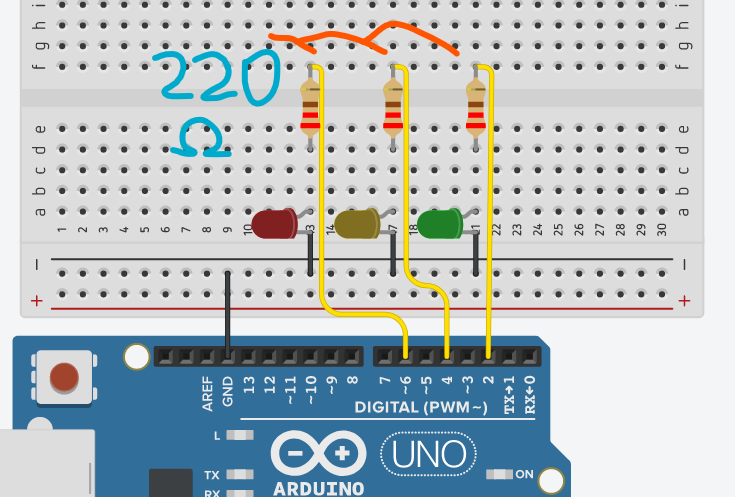

# Arduino controlled by Javascript
### In this project, you can control 3 LEDs with an Arduino via Browser, using only NodeJS! Follow along with this guide so you can set up this project on your PC.

------------

### Roadmap:
**1. Arduino Circuit**

**2. Arduino Program**

**3. NodeJS Server**

**4. Front-end**

**5. Back-end**

**6. *CONNECTING EVERYTHING***

------------

## 1. Arduino circuit
### Get the materials below and  You will need:
- 3 LEDs (with different colors, if possible);
- 3 3 resistors of 220 Ω
- 1 Protoboard;
- 1 Arduino;
- Some cables
### Take the materials above and assemble the circuit following the image:
